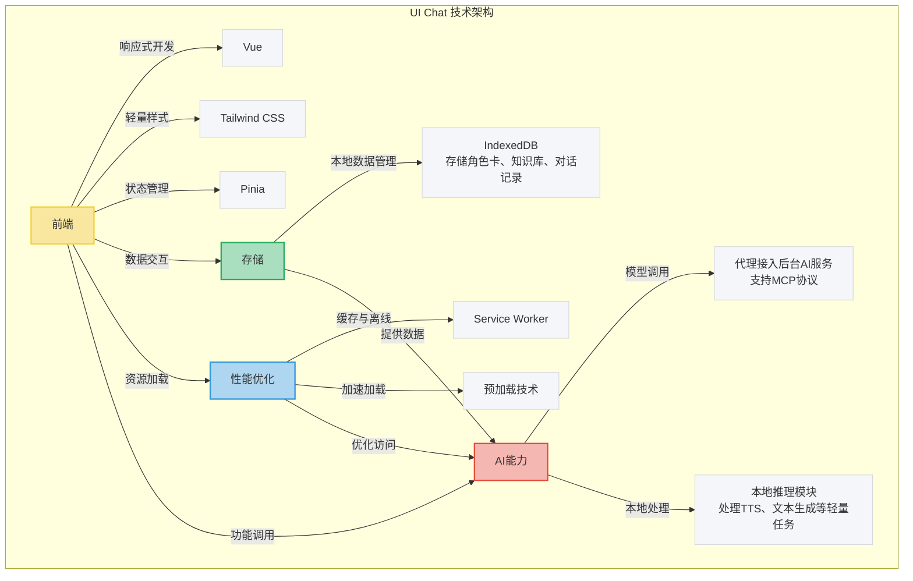

# 什么是UI Chat

UI Chat 是一个纯浏览器端的AI对话界面，源于个人博客 tomz-blog 的开发需求。在使用 deno+preact 开发时，轻量与可扩展的优势虽突出，但缺乏成熟的AI集成方案。为此，UI Chat 基于 Vue 启动，具备以下特点：

- 纯浏览器实现，数据存储于 IndexedDB，无需服务器支持。
- 使用 Vue + Tailwind 开发，组件化设计轻量且灵活。
- 非必要不与后台交互，最大化利用浏览器原生能力。

## 主要功能

- **提供200多个角色卡**：内置多样化的AI角色模板，满足用户个性化对话需求。目前支持超过200种预定义角色，用户可通过界面选择不同角色进行交互，例如“技术顾问”或“创意助手”，每个角色拥有独特的对话风格。
- **知识库支持**：允许用户上传自定义知识库，提升AI回答的针对性。用户可将文本文件、PDF等导入IndexedDB，AI会根据这些数据提供更具上下文的回答，例如回答特定领域的专业问题。
- **MCP（Model Context Protocol）支持**：  
  MCP（Model Context Protocol）是由 Anthropic 于2024年11月推出的一种开源协议，旨在为大语言模型提供标准化的外部数据连接方式。在 UI Chat 中，MCP 支持通过客户端-服务器架构，将本地对话上下文与外部AI模型高效对接，提升多轮对话的连贯性和响应速度。例如，在用户进行多轮技术问题咨询时，MCP 确保 AI 能够记住之前的对话上下文，避免重复提问。
- **基于插件构建**：支持功能模块化扩展，便于快速集成新特性。例如，用户可通过插件添加语音输入模块或第三方API支持，所有插件均可在浏览器端动态加载。

## 使用场景

- **个人AI需求**：支持用户通过对话界面与AI交互，完成文本生成、问题解答或日程规划等任务。例如，用户可输入“总结这篇文章”并上传文档，AI将快速生成摘要；或输入“明天9点提醒我开会”，本地生成提醒通知。
- **AI创作**：为创作者提供辅助工具，包括：
  - **生成文章大纲或创意灵感**：用户输入主题如“科幻小说”，AI生成详细大纲或灵感提示，提升创作效率。
  - **接入 ComfyUI 的图像生成能力**：ComfyUI 是一个开源的节点式 Stable Diffusion 界面，UI Chat 集成其功能，支持用户通过文本描述生成图像。例如，输入“未来城市夜景”，即可生成对应的视觉内容，适用于插图设计或创意展示。
  - **TTS 语音推理**：将文本转化为自然语音输出，例如将文章转为音频文件，支持播客制作或无障碍阅读。UI Chat 使用 Web Speech API 实现本地 TTS 推理，支持超过20种语言和多种语调调整，平均生成1分钟语音的延迟约为500毫秒，所有处理均在浏览器端完成，无需网络连接。

## 性能

UI Chat 基于 Service Worker 实现资源缓存与离线支持，确保核心功能在无网络环境下仍可使用。通过预加载关键脚本与静态资源（如角色卡数据和核心 UI 组件），首次加载时间缩短至 2 秒以内，后续访问可实现近乎瞬时响应。此外，缓存策略有效减少网络请求，例如将静态资源和历史对话数据存储在本地，提升弱网环境下的稳定性。在 4G 网络下，页面加载时间约为 1.8 秒，而在弱网（2G）环境下，加载时间仍可控制在 5 秒以内。在断网状态下，用户仍可使用已缓存的角色卡和知识库进行对话，但需联网时更新 AI 模型数据或调用 ComfyUI 图像生成功能。

## 技术拓扑图

以下是 UI Chat 的技术架构图，展示了各模块之间的关系：

**说明**：

- **前端**：Vue 提供响应式开发体验，Tailwind CSS 简化 UI 设计，Pinia 作为状态管理库，管理角色卡选择、对话状态等全局数据。
- **存储**：IndexedDB 作为本地数据库，存储角色卡、知识库和对话记录。
- **性能优化**：Service Worker 负责缓存和离线支持，预加载技术加速资源加载。
- **AI 能力**：通过代理接入后台 AI 服务（支持 MCP 协议），本地推理模块处理 TTS、文本生成等轻量任务。

---

UI Chat 是一个轻量、高效的纯浏览器端 AI 对话工具，通过 Vue 和现代前端技术实现了灵活的组件化设计和强大的离线支持。其核心功能包括角色卡、知识库、MCP 协议支持以及插件化扩展，适用于个人 AI 需求和创作场景。未来计划包括优化本地推理性能（例如通过 WebAssembly 加速 TTS 推理）、扩展 ComfyUI 的图像生成能力，以及支持更多语言的 TTS 功能。